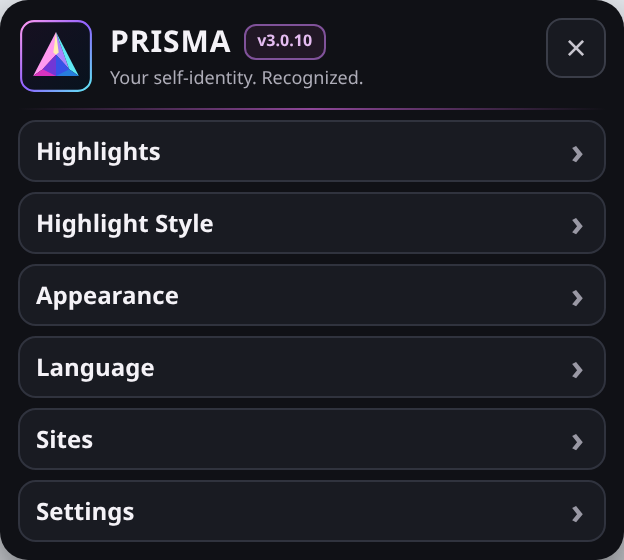
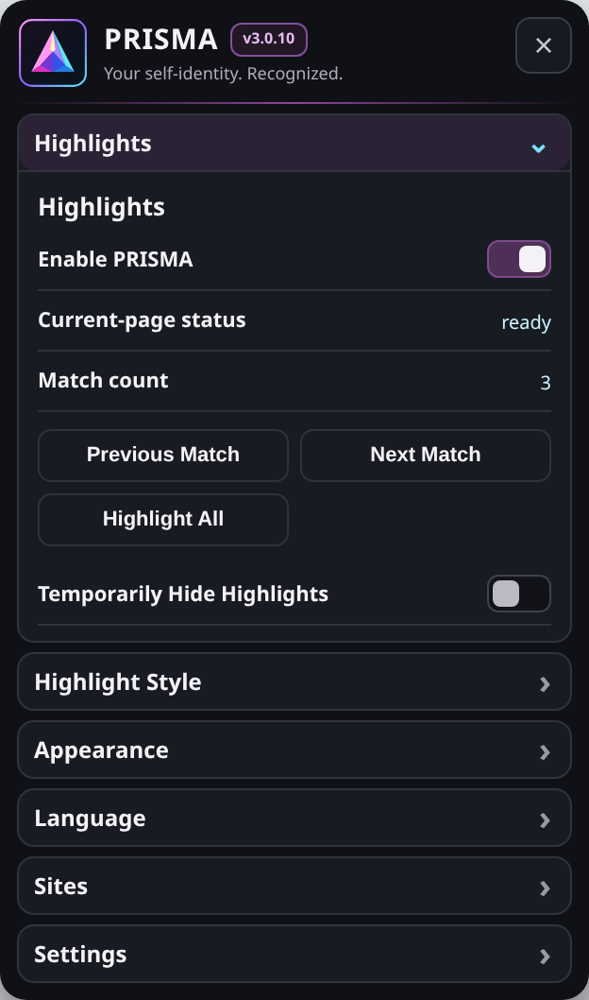
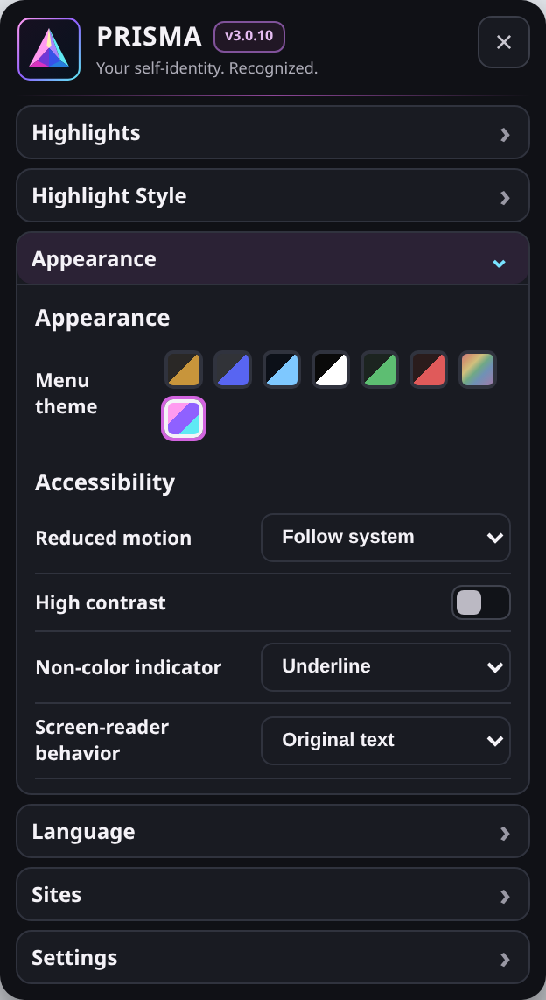
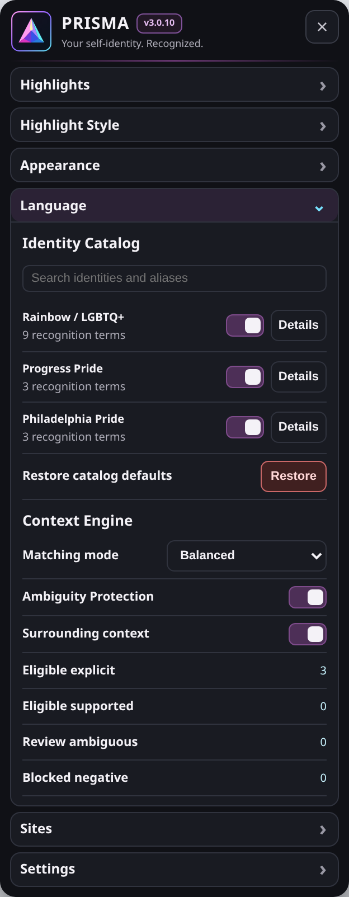
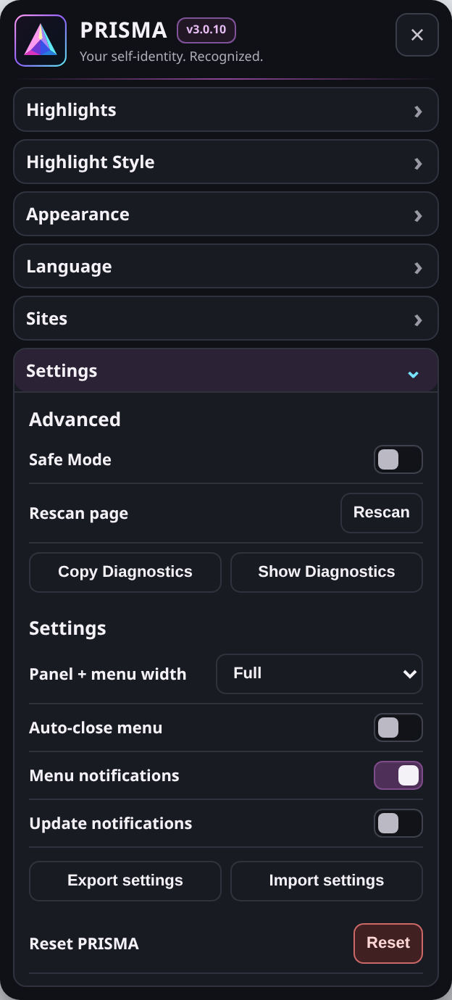

  

<h1 align="center">PRISMA</h1>

<strong>Context-Aware Identity Highlighting</strong>

  A local identity-language companion for recognizing reviewed LGBTQ+ terms with context-aware, reversible highlighting.

  
  
  
  
  
  

## Install

  
  
  

## What PRISMA Does

- Recognizes reviewed LGBTQ+ identity terms using local context and ambiguity rules.
- Offers gradient, underline, and soft-fill highlighting with adjustable appearance.
- Provides current-page match navigation and a searchable identity-language catalog.
- Supports site controls and route-aware rescanning for dynamic pages.
- Keeps recognition local and exposes privacy-safe diagnostics without collecting page text.
- Includes shared launcher placement, coordinated themes, and concise update notices.

## Screenshots

<table>
  <tr><th width="20%">Overview</th><th width="20%">Highlights</th><th width="20%">Appearance</th><th width="20%">Language</th><th width="20%">Settings</th></tr>
  <tr><td align="center"></td><td align="center"></td><td align="center"></td><td align="center"></td><td align="center"></td></tr>
</table>

## Diagnostics and product compatibility

Use **Show Diagnostics** / **Hide Diagnostics**, then **Copy Diagnostics** when troubleshooting. Reports include **Page**, **Technical**, **Console**, and **Plugin** sections, identify active ExtraPotions products and visible conflicts on the current page, and are never uploaded automatically.

## License

**Code:** [PolyForm Noncommercial License 1.0.0](LICENSE-CODE.md) 
**Artwork and documentation:** [CC BY-NC-SA 4.0](LICENSE-ASSETS.md)

See [NOTICE.md](NOTICE.md) for the split-license notice.

## Disclaimer

PRISMA is an independent project and is not affiliated with or endorsed by the websites it supports.
