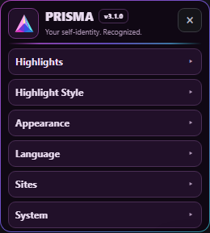
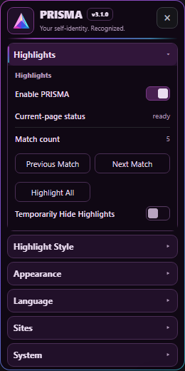
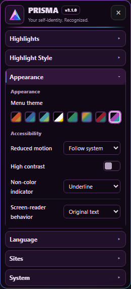
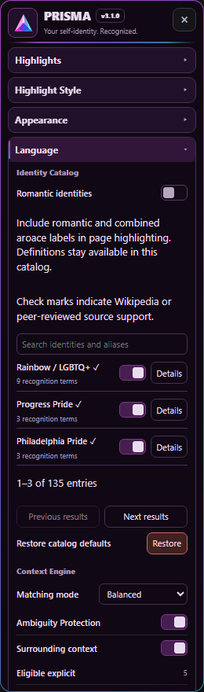
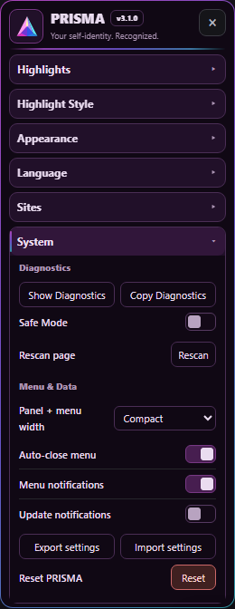

  

<h1 align="center">PRISMA</h1>

<strong>Context-Aware Identity Highlighting</strong>

  A local identity-language companion for recognizing reviewed LGBTQ+ terms with context-aware, reversible highlighting.

  
  
  
  
  
  

## Install

  
  
  

## What PRISMA Does

**PRISMA 3.1.2** is the stable rebuild with the shared exp-core foundation and expanded reference catalog.

The rebuild pins the byte-verified **exp-core 3.3.4** bundle, derived from **Dropper 3.3.3**, and uses its product shell and menu notices. It includes the shared launcher-backdrop isolation fix verified during SHIFT development. PRISMA retains its JavaScript-only architecture, schema-1 settings, and expanded catalog of 135 entries and 257 terms. SHIFT's page recoloring and Dropper's Twitch automation remain product-specific.

- Recognizes reviewed LGBTQ+ identity terms using local context and ambiguity rules.
- Offers gradient, underline, and soft-fill highlighting with adjustable appearance.
- Offers optional Pulse, Shimmer, and Glow animation styles with saved preferences and reduced-motion support.
- Provides current-page match navigation and a searchable identity-language catalog.
- Supports site controls and route-aware rescanning for dynamic pages.
- Keeps recognition local and exposes privacy-safe diagnostics without collecting page text.
- Includes shared launcher placement, coordinated themes, and concise update notices.

## Catalog references

All 135 entries and 257 recognition terms have individual definition and flag review records. 133 definitions have reviewed public references; 2 remain provisional. Under the requested evidence rule, 106 entries are Wikipedia-listed and receive a check icon; 29 remain unverified. Multiple references are retained. The 11 romantic and combined aroace entries stay in the database and are controlled by the Romantic identities toggle, off by default. Flag designs are documented for 112 entries; 23 remain unresolved. 30 highlight palettes have exact color evidence, 34 remain inherited, and 71 use neutral underlines. See [catalog sources and per-entry review](docs/catalog-sources.md).

## Screenshots

Screenshots show PRISMA 3.1.0.

<table>
  <tr><th width="20%">Overview</th><th width="20%">Highlights</th><th width="20%">Appearance</th><th width="20%">Language</th><th width="20%">Settings</th></tr>
  <tr><td align="center"></td><td align="center"></td><td align="center"></td><td align="center"></td><td align="center"></td></tr>
</table>

## Diagnostics and product compatibility

Use **Show Diagnostics** / **Hide Diagnostics**, then **Copy Diagnostics** when troubleshooting. Reports include **Page**, **Technical**, **Console**, and **Plugin** sections, identify active ExtraPotions products and visible conflicts on the current page, and are never uploaded automatically.

## Local verification

Run `npm ci`, `npx playwright install chromium`, `npm test`, and `npm run release:check`. The checks cover matching, dynamic content, navigation, reversible rendering, settings recovery, keyboard access, shared notice geometry, and hostile page backdrop styles. The release check validates the local artifact without publishing it.

## License

**Code:** [PolyForm Noncommercial License 1.0.0](LICENSE-CODE.md) 
**Artwork and documentation:** [CC BY-NC-SA 4.0](LICENSE-ASSETS.md)

See [NOTICE.md](NOTICE.md) for the split-license notice.

## Disclaimer

PRISMA is an independent project and is not affiliated with or endorsed by the websites it supports.

## Firefox compatibility update

Restores Firefox startup on pages with restrictive security policies using content injection. Keeps settings copies in the userscript realm and bundles exp-core 3.3.5 with idle menu fixes.

## 3.1.2 update

Restores the donation button through the shared core default. Bundles exp-core 3.3.6 so opening one launcher menu closes other product menus.
