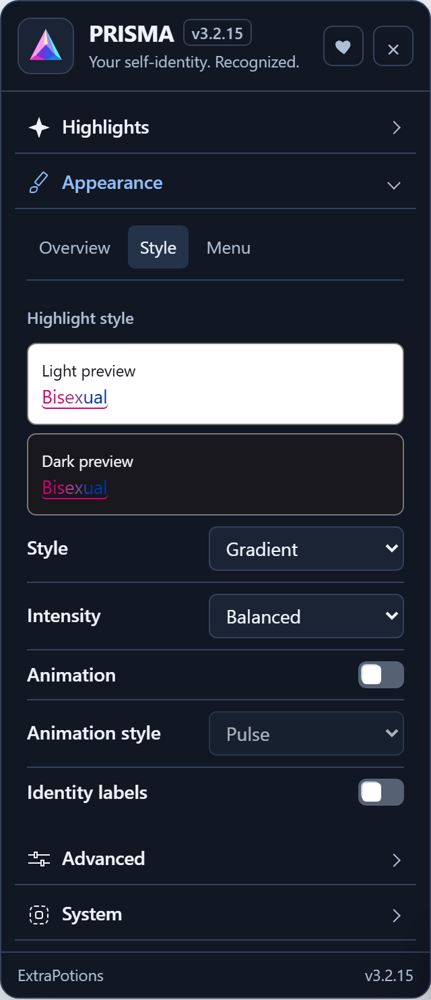

# PRISMA

**Identity language, easier to explore.**

## Get started

1. Install a userscript manager such as [Violentmonkey](https://violentmonkey.github.io/get-it/) or [Tampermonkey](https://www.tampermonkey.net/).
2. [Install PRISMA](https://github.com/ExtraPotions/PRISMA/releases/latest/download/prisma.user.js) and confirm in your userscript manager.
3. Refresh any page and open the PRISMA launcher.

## What you can do

- **See identity terms in context:** LGBTQ+ identity terms are highlighted in their flag colors, with ambiguous matches held back.
- **Learn what a term means:** open a highlight to see its definition and sources, or hide a phrase on that site.
- **Choose the look:** gradients, underlines, or soft fills, with optional animation and a live light/dark preview.
- **Explore the catalog:** search identities, include or exclude romantic terms, and choose the sites PRISMA runs on.

Known banking, healthcare, and email sites stay unchanged unless you enable PRISMA for that site.

## See it in action

<table>
  <tr>
    <td width="50%" valign="top" align="center"> <strong>Highlights on a page</strong></td>
    <td width="50%" valign="top" align="center"> <strong>Highlight style with live preview</strong></td>
  </tr>
</table>

Screenshots use sample content.

## Support

[Support development](https://ko-fi.com/expdare). Donations are optional. All features remain available without donating.

## License

**Code:** [PolyForm Noncommercial License 1.0.0](LICENSE-CODE.md) 
**Artwork and documentation:** [CC BY-NC-SA 4.0](LICENSE-ASSETS.md)

PRISMA is an independent project and is not affiliated with or endorsed by the websites where it is used.
