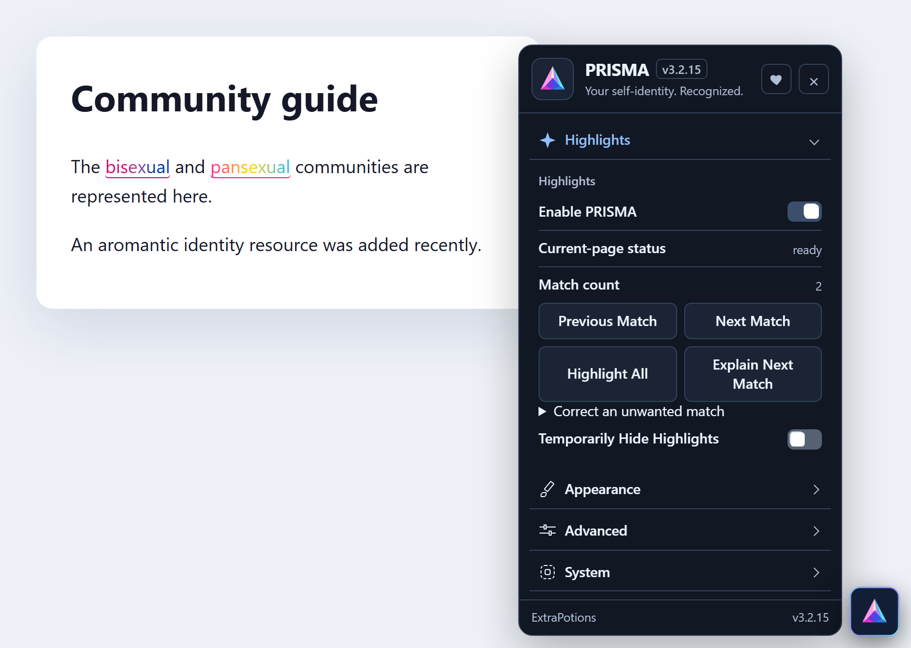
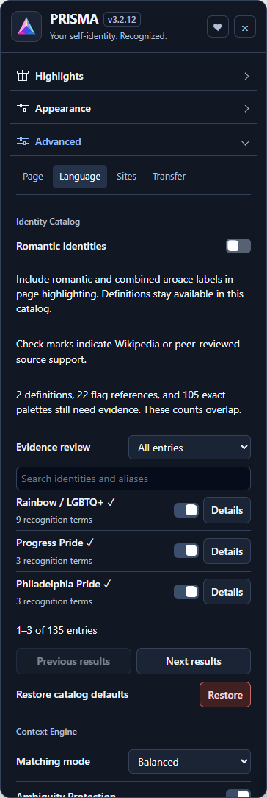

# PRISMA

Current release: **3.2.9**.

**Identity language, easier to explore**

Recognize LGBTQ+ identity terms in context, see their colors, and explore recognized terms while you read.

## Get started

1. Install a userscript manager such as [Violentmonkey](https://violentmonkey.github.io/get-it/) or [Tampermonkey](https://www.tampermonkey.net/).
2. [Install PRISMA](https://github.com/ExtraPotions/PRISMA/releases/latest/download/prisma.user.js) and confirm in your userscript manager.
3. Refresh a page you want to use and open the product launcher.

Open Highlights to explore matches on the current page. Use Highlight Style for colors and animation, Language for the catalog, and Sites for website preferences.

## What you can do

- **Compact submenu tabs:** switch between related settings without opening a stack of nested menus. Each product keeps its own colors, and System stays last.

- **Simple System menu:** The Status tab shows its reason and recovery action, plus recent activity. Support holds Copy Diagnostics and Report a Problem. Reset asks for a second tap inside the menu.

- **Distinct menu colors:** sapphire-blue accents, navy surfaces, and violet and cyan details match PRISMA's gem.
- **System status:** see Working, Waiting, Paused, or Needs attention, with a reason and a safe recovery action when available.
- **Live style preview:** compare the actual highlight and animation on light and dark surfaces while adjusting Appearance.

- **Keep your settings:** saved preferences and existing settings exports remain supported as product naming is simplified.

- **Readable menus:** choose Standard (14px text), Large (16px), or Extra Large (18px) from Appearance > Menu. Captions start at 12px. Labels, dropdowns, toggles, and buttons share consistent spacing and alignment. The choice applies to ExtraPotions menus on this site.

- **Match explanations:** activate a highlight or choose Explain Next Match to see its meaning and sources. Ignore a phrase on the current site directly from its explanation.
- **Context-aware highlights:** find recognized identity terms while reducing ambiguous matches.
- **Choose the style:** gradients, underlines, soft fills, and optional animation with adjustable appearance.
- **Explore language:** search the identity catalog and explore definitions, flag colors, and source information.
- **Romantic identities:** choose whether to include romantic terms, and enable or disable individual identities.
- **Page navigation:** move between current-page matches and choose where PRISMA runs.

## See it in action

Screenshots show the current product with sample content.

<table>
  <tr>
    <td width="50%" valign="top" align="center"> <strong>Identity highlights in sample text</strong></td>
    <td width="50%" valign="top" align="center"> <strong>Searchable identity catalog</strong></td>
  </tr>
</table>

## Support

[Support development](https://ko-fi.com/expdare). Donations are optional. All features remain available without donating.

## License

**Code:** [PolyForm Noncommercial License 1.0.0](LICENSE-CODE.md) 
**Artwork and documentation:** [CC BY-NC-SA 4.0](LICENSE-ASSETS.md)

## About

PRISMA is an independent project and is not affiliated with or endorsed by the websites where it is used.

Smaller install files keep installation lightweight without removing features.

Known banking, healthcare, and email sites stay unchanged until you enable that exact site. Starter coverage is not universal; your site exclusions always take priority.
